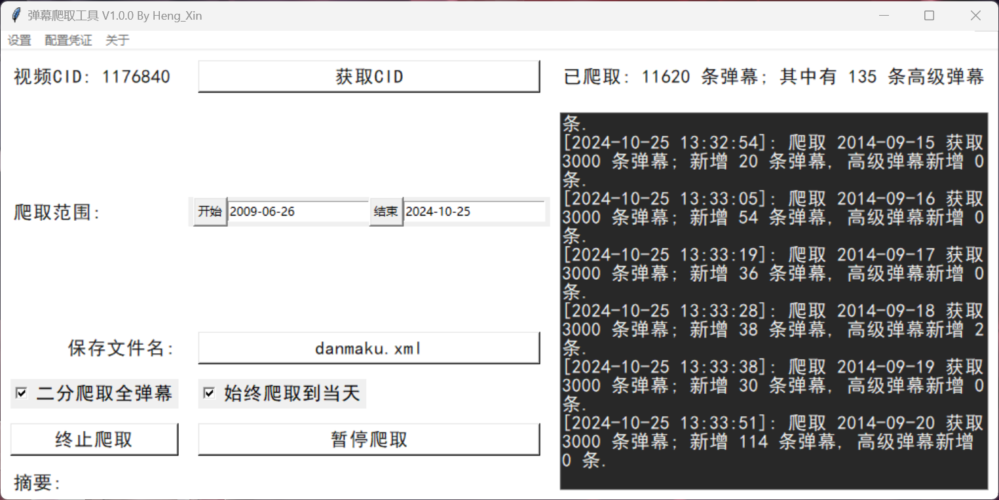
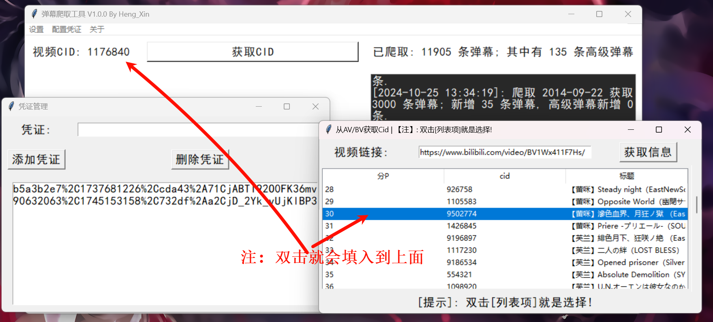
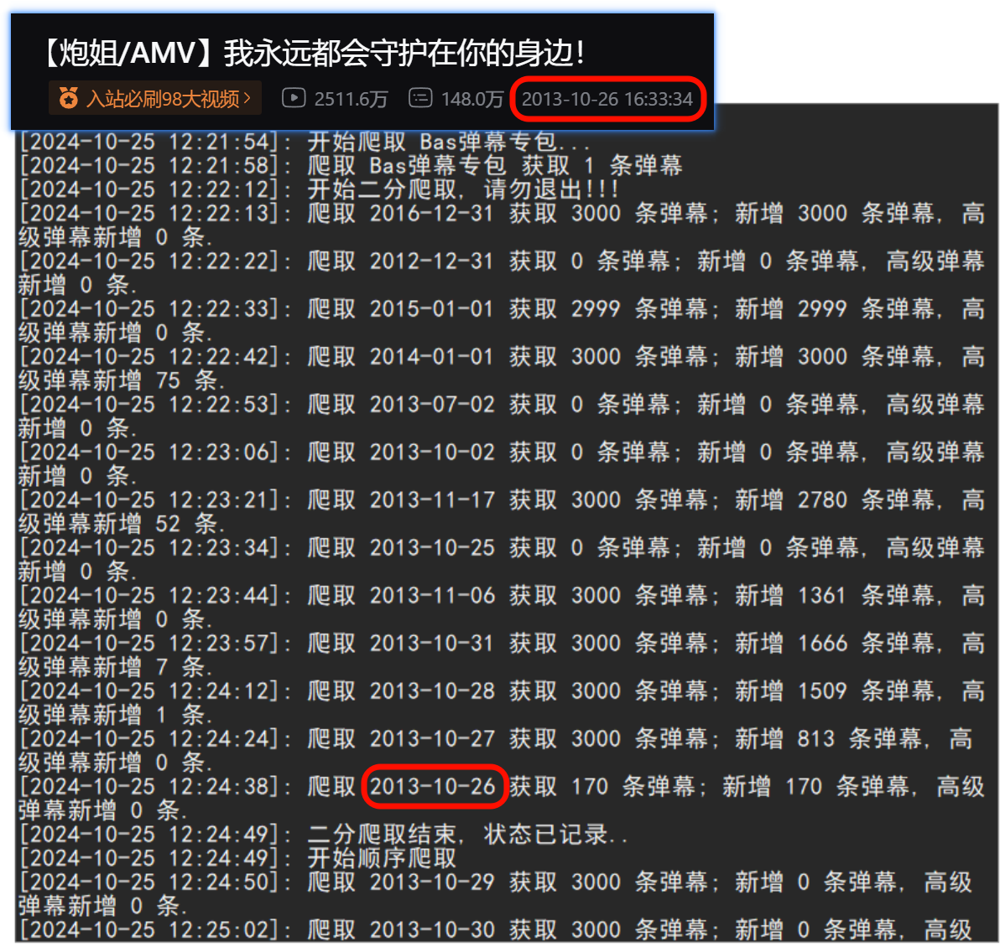
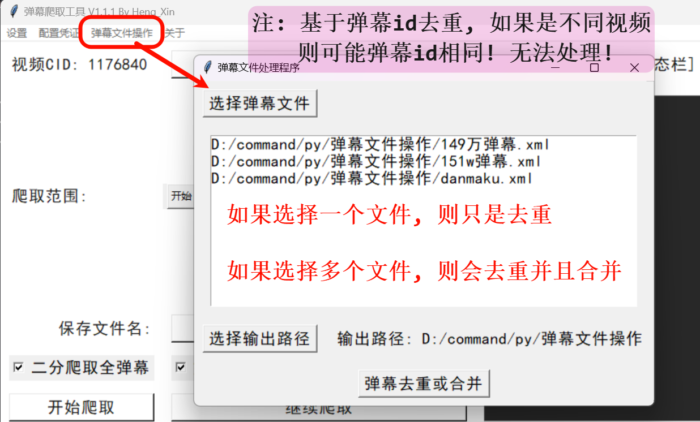
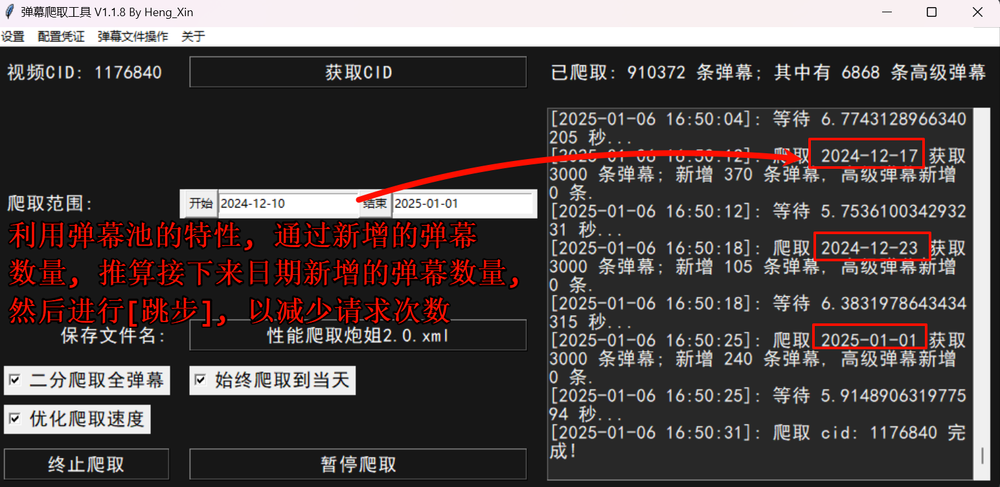
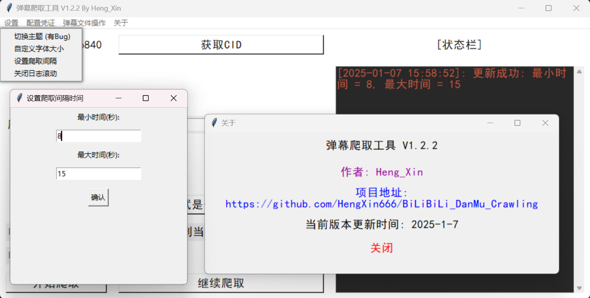
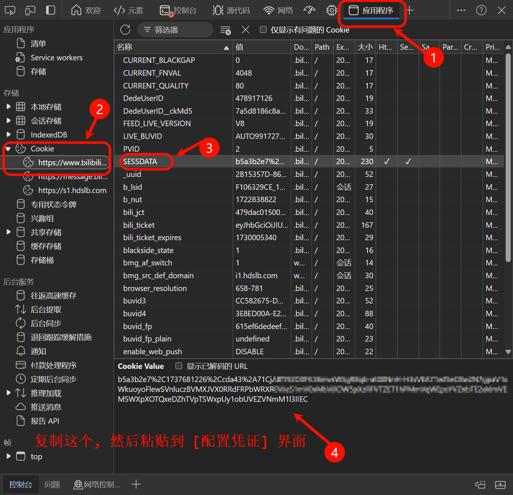

<h1 align="center" style="color:yellow">BiliBili历史全弹幕获取</h1>

## 一、功能说明

1. 本程序可爬取B站视频的历史弹幕, 支持爬取`高级弹幕`/`BAS弹幕`

2. 程序带有GUI界面.

    > 

3. 支持多个`cookies`, 并且随机选择一个进行爬取.

    > 

4. 支持断点续爬: 可以从上一次爬取的地方接着开始爬取, 并且 **实时** 输出弹幕文件(`.xml`)

5. 会自动保存上一次的配置, 下一次打开不需要重新输入, 直接`继续爬取`即可!

6. 利用`二分`定位第一个有弹幕的天数:

    > 
    >
    > 之后会跳过在`二分`时候已经爬取的数据, 避免重复爬取
    > 
    > (因为之前的`判断这个月存在弹幕的天数`的api, 只能返回`2021-07`之后的数据; 因此改为`二分`确定范围)
    
> [!TIP]
>
> 为什么不是手动输入爬取范围为`视频发布日期`呢?
>
> 答: 因为我发现, `av314`它的发布日期是`2012-08-19`(B站界面上显示); 但是爬取`2012-07-19`也是有历史弹幕返回的 (可能某些原因视频被重新上传? 或者B站炸了); ~~(总之不能浪费)~~

> [!NOTE]
> 值得注意的是，`二分爬取`确定日期的速度是原方法的：
>
>$$
\frac{\frac{n}{30}}{\log{(n + (\text{beginDate} - \text{Date("2009-01-01")}))}}
$$
>
>倍！
>
> 其中:
> 
> $$
n = \text{endDate} - \text{beginDate}
$$
>
> $n$ 为总爬取天数。
>
> 实际上, 速度提升的倍数可以简化为: $\frac{n}{\log n}$,
>
> 这是一个很大的提升, 比如原本我们需要从`2013~2025年`的每一个月都请求一次, 现在只需要二分不到 $13$ 次, 即可确定!

7. 始终爬取到当天: 可能爬取很久, 可能已经到了新的一天了; 因此爬取弹幕也可以设置爬取新的一天的; 而不是定死在了开始爬取的那一天.

8. 可以对弹幕文件进行去重/合并:

    > 

9. 算法优化的跳步:

    > 
    >
    > 如 [#7: 提议 | 开发优化的爬取方式？](https://github.com/HengXin666/BiLiBiLi_DanMu_Crawling/issues/7) 中描述的`弹幕池`的特性, 编写了对应的实验环境: [py仿真代码](test/sugaku.py) 进行可行性实验; 
    >
    > 最终, 评测: [#8: 反馈 | 使用[优化爬取速度]选项, 速度提升、是否会缺少弹幕の探讨](https://github.com/HengXin666/BiLiBiLi_DanMu_Crawling/issues/8)
    >
    > **结论**: 爬取速度提升(请求总次数减少), 爬取的弹幕数几乎不变; 如果不追求一条弹幕也不少的话, 可以使用. *(个人认为这个是不会丢失弹幕的!)*

10. 设置爬取间隔:

    > (每次程序启动都会重新初始化为`[8, 15]`, 以防用户忘记)
    >
    > 您可以在爬取过程中进行调整, 会 **实时** 生效!
    >
    > 

## 二、使用

### 2.1 爬取弹幕需要获取B站的`cookies`

1. **登录**网页版B站

2. 点击键盘`F12`, 进入浏览器审查界面

3. 如下操作

    > 

4. 复制到程序对应地方, 进行添加

### 2.2 爬取步骤

爬取步骤:

0. 配置凭证 (获取`cookies`)
1. 获取视频cid
2. (可以修改输出的弹幕文件名称 | 其他设置不懂就默认即可)
3. 点击`开始爬取`
4. 等待...

> [!TIP]
> - 如果不小心退出的话, 下次请点击`继续爬取`, 会接着爬取. (一次爬取中不要改文件名称, 否则弹幕文件就分开了)
> 
> - 只有在`开始爬取`的时候, 可以修改一些配置(比如: `是否二分爬取`和`开始时间`), 在`继续爬取`时候修改无效!
>
> ~~其他功能可以自己探索, 现在bug不多了, 不是暴力测试, 一般用不坏的qwq...~~

弹幕文件会输出在`/output`下面 (.exe版本请见.txt中描述的路径)

## 三、构建要求

- python3.10+ (我本地环境是`3.12.7`)

安装下列依赖:

```sh
pip install requests protobuf
```

如果还不行就请参照 [requirements.txt](./requirements.txt) 这个是我导出的所有安装的第三方库, 可能有用不上的.

## 四、存在问题 & 更新计划
### 4.1 更新计划

- [ ] 使用更加高效的, $O(n / w)$ 的爬取算法

- [ ] 支持多个内容爬取, 比如监听整个收藏夹的内容; 一键爬取一整部番剧...

- [ ] 重构为前后端应用, 并且支持 Docker 部署

### 4.2 存在问题
- GUI太丑了... *`没有办法, 这个只是方便大家使用的, 能用即可`*

- 请小心使用, 我只能保证简单的GUI逻辑没有问题(爬取/继续爬取); 一些复杂的GUI联动细节我可能没有注意到, 从而可能会导致BUG!

- 请务必点击`暂停爬取`, 再关闭程序; 否则可能会丢失配置!

- 关闭程序请点击窗口的叉叉; 而 **不是** 强行关闭控制台窗口或者对控制台`ctrl+c`, 可能导致配置丢失!!!

- [x] 爬取性能优化: 因为弹幕池的增量可能每天就只有几百条, 而容量却是3000条; 从而导致爬取的3000条弹幕中, 可能有2000条是多余的, 此时应该可以改变步长, 隔几天才爬取一天, 这样爬取的数量就多了 (没时间搞这个了, 目前能用就行了...)

- 这种爬取模式(断点继爬)下, 难免会存在重复弹幕, 有条件的可以使用其他软件对弹幕进行去重~ *`(或者使用本程序自带的去重功能)`*

- 似乎`mac`系统存在 **不显示** 工具栏的问题, 如果不是您系统有特别设置[默认隐藏工具栏]的话, 那么非常抱歉, 您可能需要通过修改`配置文件`来搞定`凭证配置`问题qwq...

> [!TIP]
> 值得注意的是! 在二分模式下, 会自动从2009开始二分! 这个是特性. (因此需要指定开始日期的话, 请关闭`二分爬取`)

## 五、问题反馈

- 您可以提`Issues`, 我几乎都会看的qwq..

## 六、许可证

简单地说:

- 不允许商用行为

- 产生不良后果, 与作者无关

- 必要时, 请标明出处

## 七、致谢
### 7.1 感谢开源项目
- [哔哩哔哩 - API 收集整理](https://github.com/SocialSisterYi/bilibili-API-collect)

### 7.2 感谢各位项目支持者

感谢各位的支持, 如果喜欢的话可以点一个`Start`吗?

[](https://github.com/HengXin666/BiLiBiLi_DanMu_Crawling/stargazers)

[](https://github.com/HengXin666/BiLiBiLi_DanMu_Crawling/network/members)

## 八、更新日志

- [2025-07-10 21:40:32] [V1.5.0] 修复了 [#18](https://github.com/HengXin666/BiLiBiLi_DanMu_Crawling/issues/18) 和 [#19](https://github.com/HengXin666/BiLiBiLi_DanMu_Crawling/issues/19) 中提到的 XML 转义字符的问题, 现在程序会对这些字符进行转义了!
- [2025-07-04 10:20:23] [V1.4.2] 合并了 [#17](https://github.com/HengXin666/BiLiBiLi_DanMu_Crawling/pull/17) 以支持获取弹幕权重(`权重字段可用于本地过滤弹幕(b站旧版的弹幕等级屏蔽功能)`), 但是似乎解析不到这个字段(?)
- [2025-06-21 23:13:02] [V1.4.1] 修复没有设置凭证, 就开始爬取会导致子线程退出的问题, 现在会及时给出提醒.
- [2025-06-21 23:04:54] [V1.4.0] 添加了一键构建 `AppImage` 的脚本 (自用) | 修改配置文件存放于系统配置文件目录 ([#16](https://github.com/HengXin666/BiLiBiLi_DanMu_Crawling/issues/16)) | 并且文件输出适配 win/linux 的环境
- [2025-06-21 17:31:55] [V1.3.2] 修复输出弹幕XML格式的问题 (注意, 如果需要获取到完整的XML, 需要手动终止爬取; 否则就需要手动为弹幕末尾添加`</i>`; 不然可能会在某些地方解析弹幕出错) ([#15](https://github.com/HengXin666/BiLiBiLi_DanMu_Crawling/issues/15)) | 调整了部分目录结构 | 新增了单独的版本描述文件
- [2025-04-29 21:00:25] [V1.3.1] 支持从番剧获取cid (支持从md、ss、ep号获取) ([#9](https://github.com/HengXin666/BiLiBiLi_DanMu_Crawling/issues/9))
- [2025-01-07 16:10:38] [V1.2.3] 修复无法保存是否使用`跳步爬取`的bug
- [2025-01-07 14:47:55] [V1.2.2] 修复`跳步爬取`, 如果跳出了有效范围, 会不爬取的问题, 即如果跳过了需要爬取的那一天, 则会默认爬取`endDate`那一天, 以防遗漏.
- [2025-01-06 17:30:33] [V1.2.1] 新增`跳步爬取`, 根据弹幕池的特性, 采取跳步爬取模式, 将连续几天的弹幕合并为一天爬取, 可是时间一般为原来的 $\frac{1}{5}$ (详细测试请查看[#8](https://github.com/HengXin666/BiLiBiLi_DanMu_Crawling/issues/8), 原理[#7](https://github.com/HengXin666/BiLiBiLi_DanMu_Crawling/issues/7))
- [2024-12-11 17:13:39] [V1.1.8] 修复指定开始、结束爬取时间无法及时生效的bug, 修复在去重文件时候出现Bas弹幕, 会导致程序崩溃的问题; 优化: 文件默认后缀是xml文件, 改名字不用手动输入后缀.xml
- [2024-11-15 14:56:05] [V1.1.7] 修复无法指定起始日期的bug
- [2024-11-02 13:21:03] [V1.1.6] 修复了一个潜在的f-string错误, 对项目进行`.exe打包`
- [2024-10-31 11:09:40] [V1.1.5] 修复了`始终爬取到当天`的日期显示不跟随的问题, 现在每次开启都会先检查一次日期
- [2024-10-28 21:38:17] [V1.1.4] 修复了`从指定日期开始`功能无法使用的问题, 现在每进行一次顺序爬取都会保存状态, 防止丢失进度.
- [2024-10-28 17:38:43] [V1.1.3] 修复了无限爬取Bas弹幕的Bug
- [2024-10-28 17:32:15] [V1.1.2] 修复了如果在继续爬取的时候, 重命名了文件并打算重新爬取, 导致删除文件, 文件找不到, 而终止线程的BUG
- [2024-10-27 15:06:19] [V1.1.1] 新增简单的弹幕文件操作, 支持去重和合并.
