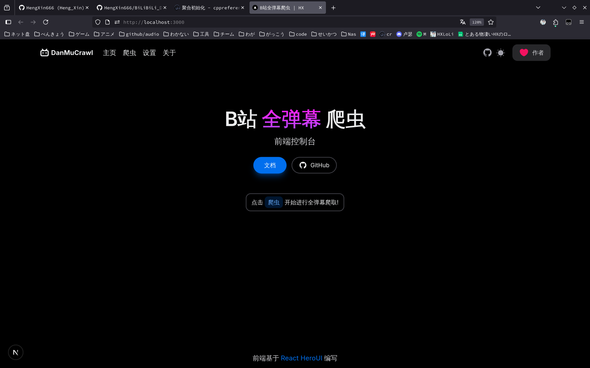
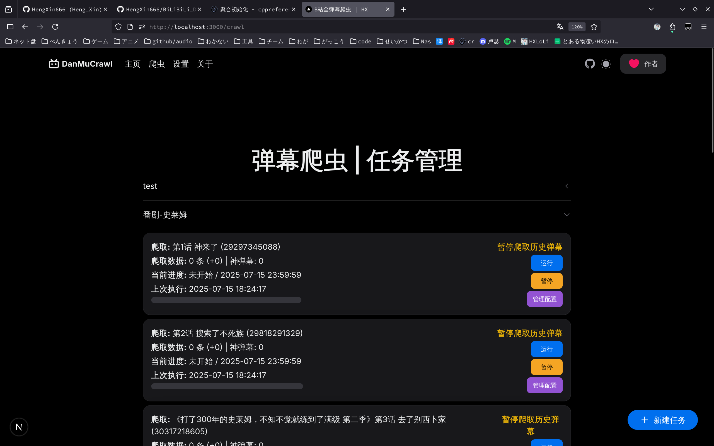
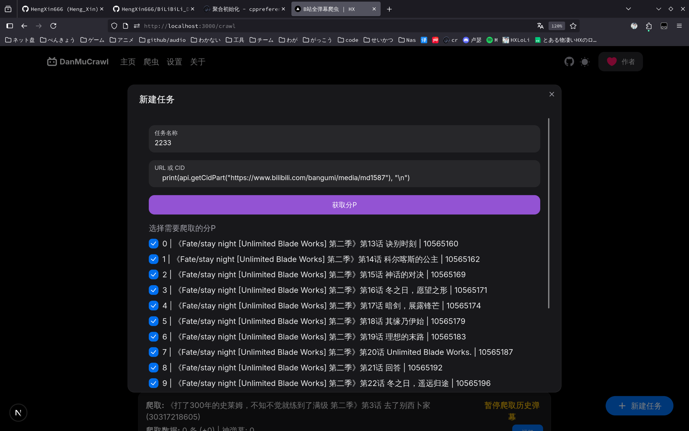
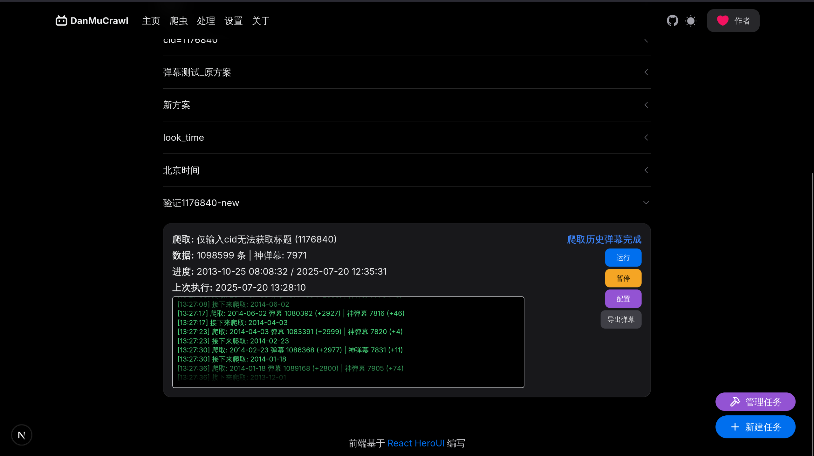

<h1 align="center" style="color:yellow">BiliBili历史全弹幕获取</h1>

> [!TIP]
> 当前为全新版本的开发分支
>
> 正式版本请查看 [v1.5.1-old-ed](https://github.com/HengXin666/BiLiBiLi_DanMu_Crawling/tree/v1.5.1-old-ed) 分支
>
> 新版本正在重构, 到时候将采用网页端 + py后端的模式, 可以方便的管理不同视频的爬取进度
>
> 同时也极大的方便了番剧、多P视频的弹幕爬取; 期望还加入实时弹幕监测, 提供Docker部署, 即刻起将不会丢失任何弹幕!

## 零、临时架构

```cpp
爬取侧: py 爬虫, 通过命令参数驱动
    - 纯命令行使用
    - [x] 作为服务程序启动 (方便进程间通信)

// 客户端: C++ QT, 发送命令给爬取侧, 爬取侧返回进度

前端: React (TS), 发送命令给爬取侧, 爬取侧返回进度 (Docker 版本)

// ======================================================= //

py 爬取流程: [使用后向爬取] https://github.com/HengXin666/BiLiBiLi_DanMu_Crawling/issues/14

    *0. 输入爬取的日期范围 [左边界, 右边界] -> 当前日期 = 右边界

    1. 爬取 [当前日期] 的历史弹幕

    2. 解析历史弹幕中 [非保护弹幕] 的弹幕中, 最早的时间

    3. 从该日期继续爬取

    *4. 如果 [当前日期 < 左边界] 则爬取结束, 否则 goto {1.}

    *5. 如果用户选择爬取全弹幕, 则无需设置 [爬取的日期范围]

        > 自动从当前日期开始爬取, 直到 {爬取 [当前日期] 的历史弹幕} -> 0 条弹幕

        然后进入[弹幕跟踪服务](需要开启): 间隔一段时间(可设置) 会爬取实时弹幕池
    
    最终产生内容: [注意, 一次爬取任务对应一个配置]
        1. 配置文件(.json), 存放本次爬取任务的配置, 包含:
            配置文件id (需要唯一, 因为cid可能重复(用户创建多个一样的爬取任务), 不能仅通过它来区分)
            爬取的视频的 cid
            爬取的视频标题
            最后一次进行爬取的时间
            爬取区间 [L, R]
            当前爬取的时间 (当且仅当 爬取 历史弹幕 有效)
            总弹幕条数, 高级弹幕(含代码弹幕/Bas弹幕)条数
            爬取状态 {
                正在爬取历史弹幕,
                暂停爬取历史弹幕,
                爬取历史弹幕被封禁中,
                正在爬取实时弹幕,
                暂停爬取实时弹幕,
                实时弹幕弹幕被封禁中,
            }

        2. 弹幕mid 文件, 该文件用于去重弹幕, 并且文件仅记录mid, 以简化解析策略

        3. 弹幕元信息存放文件, 一个弹幕数据的临时存放文件, 非 xml 文件; 应该是 sql 存储

            > 用户可以选择导出弹幕, 此时会生成一个完整的 xml 文件

    总配置文件:
        仅记录 cookies (cookie 的 list)
        爬取时间间隔区间 [int, int] (单位: 秒)
    
    所有内容记录在
        当前程序目录下(跨平台的), 的 reqData 文件夹

    特别情况: [[爬取番剧 / 多p]]

        策略: 首先, 全部都是以列表形式返回的, 所以我们可以统一处理:
        1. 在 reqData 下创建 文件夹 {用户命名 / 自动命名(当前时间 + 随机数)}
        2. 依据用户选择, 然后创建下面 3 个文件
            {cid}_config.json // 当前配置文件
            {cid}_dm_data.db  // 弹幕元数据
            {cid}_dm_id.db    // 弹幕唯一id数据
        3. 进行顺序爬取: 完成一个任务后才继续完成下一个任务

    展示:
        遍历 reqData 文件夹可以得到 所有任务列表
            里面的子文件夹就是子任务了
        如:

        任务:
          |- 炮姐番剧
          |     | - 01-电脑配件
          |     | - 02- ...
          |    ...
          |- 现代C++
                | - 01- xxx
            
```

## 二、预览图

> [!TIP]
> 仍在开发, 非最终效果









## 三、使用说明

@todo, 到时候可能放到我博客的单独一栏?

## 四、代码构建

- [Python 服务端](./py/README.md)

- [Web 前端](./web/README.md)

## 五、问题反馈

- 您可以提`Issues`, 我几乎都会看的qwq..

## 六、许可证

简单地说:

- 不允许商用行为

- 产生不良后果, 与作者无关

- 必要时, 请标明出处

## 七、致谢
### 7.1 感谢开源项目
- [哔哩哔哩 - API 收集整理](https://github.com/SocialSisterYi/bilibili-API-collect)

### 7.2 感谢各位项目支持者

感谢各位的支持, 如果喜欢的话可以点一个`Start`吗?

[](https://github.com/HengXin666/BiLiBiLi_DanMu_Crawling/stargazers)

[](https://github.com/HengXin666/BiLiBiLi_DanMu_Crawling/network/members)

## 八、更新日志

- [2025-07-25 23:07:45] [V2.0.0-Beta_13] [#25](https://github.com/HengXin666/BiLiBiLi_DanMu_Crawling/issues/25): ` ws后端传输缺失：当开始一个任务后，第一次爬取的日期不会显示在web端而仅会出现在后端log`; 现在为后端新增一个 运行时消息队列, 如果前端消息小于该队列, 则补充消息; 并且提供文件日志, 不同推送ws, 仅供查看. 命名为 `{cid}_log.log`. 新增一个接口.

- [2025-07-20 14:20:25] [V2.0.0-Beta_12] 简单编写了 Web 关于界面

- [2025-07-20 13:49:01] [V2.0.0-Beta_11] 修复爬取时候因使用时间戳不是北京时间而导致丢失弹幕的问题 [#23](https://github.com/HengXin666/BiLiBiLi_DanMu_Crawling/issues/23)

- [2025-07-20 11:31:50] [V2.0.0-Beta_10] 修复弹幕导出的格式错误问题(有两个字段写错了)

- [2025-07-18 16:47:02] [V2.0.0-Beta_09] 新增弹幕处理web界面(新建文件夹); 发现问题

    1. 导出弹幕很慢, 因为需要先从数据库中查询, 然后再组装为 xml, 对于 100w 弹幕, 需要十几秒
    2. 弹幕可能不全面, 虽然爬取的很多, 但是不知道为什么高级弹幕比较少, 我的代码应该不会出问题啊qwq (今晚回去统计一下)

    3. @todo 还需要写爬取 Bas弹幕 的协程任务函数

- [2025-07-18 15:10:10] [V2.0.0-Beta_08] 修改部分接口, 因为需要支持相同cid情况, 因此为许多接口拓展出配置文件的唯一id: configId; 前端支持实时更新弹幕爬取状况, 支持删除配置

- [2025-07-16 10:22:32] [V2.0.0-Beta_07] 重构的新版本, 支持了xml导出(可选是否导出权重 (如果权重为0则不显示)); 支持爬取全弹幕; 目前还差支持 Bas弹幕 爬取; 以及前端的爬取事实状态的更新

---

- [2025-07-11 23:15:01] [V1.5.1] 修复 [#21](https://github.com/HengXin666/BiLiBiLi_DanMu_Crawling/issues/21) 爬取代码弹幕和bas直接显示内容为零的问题 (原因是爬取BAS弹幕专包时候没有使用新的解析方式)
- [2025-07-10 21:40:32] [V1.5.0] 修复了 [#18](https://github.com/HengXin666/BiLiBiLi_DanMu_Crawling/issues/18) 和 [#19](https://github.com/HengXin666/BiLiBiLi_DanMu_Crawling/issues/19) 中提到的 XML 转义字符的问题, 现在程序会对这些字符进行转义了!
- [2025-07-04 10:20:23] [V1.4.2] 合并了 [#17](https://github.com/HengXin666/BiLiBiLi_DanMu_Crawling/pull/17) 以支持获取弹幕权重(`权重字段可用于本地过滤弹幕(b站旧版的弹幕等级屏蔽功能)`), 但是似乎解析不到这个字段(?)
- [2025-06-21 23:13:02] [V1.4.1] 修复没有设置凭证, 就开始爬取会导致子线程退出的问题, 现在会及时给出提醒.
- [2025-06-21 23:04:54] [V1.4.0] 添加了一键构建 `AppImage` 的脚本 (自用) | 修改配置文件存放于系统配置文件目录 ([#16](https://github.com/HengXin666/BiLiBiLi_DanMu_Crawling/issues/16)) | 并且文件输出适配 win/linux 的环境
- [2025-06-21 17:31:55] [V1.3.2] 修复输出弹幕XML格式的问题 (注意, 如果需要获取到完整的XML, 需要手动终止爬取; 否则就需要手动为弹幕末尾添加`</i>`; 不然可能会在某些地方解析弹幕出错) ([#15](https://github.com/HengXin666/BiLiBiLi_DanMu_Crawling/issues/15)) | 调整了部分目录结构 | 新增了单独的版本描述文件
- [2025-04-29 21:00:25] [V1.3.1] 支持从番剧获取cid (支持从md、ss、ep号获取) ([#9](https://github.com/HengXin666/BiLiBiLi_DanMu_Crawling/issues/9))
- [2025-01-07 16:10:38] [V1.2.3] 修复无法保存是否使用`跳步爬取`的bug
- [2025-01-07 14:47:55] [V1.2.2] 修复`跳步爬取`, 如果跳出了有效范围, 会不爬取的问题, 即如果跳过了需要爬取的那一天, 则会默认爬取`endDate`那一天, 以防遗漏.
- [2025-01-06 17:30:33] [V1.2.1] 新增`跳步爬取`, 根据弹幕池的特性, 采取跳步爬取模式, 将连续几天的弹幕合并为一天爬取, 可是时间一般为原来的 $\frac{1}{5}$ (详细测试请查看[#8](https://github.com/HengXin666/BiLiBiLi_DanMu_Crawling/issues/8), 原理[#7](https://github.com/HengXin666/BiLiBiLi_DanMu_Crawling/issues/7))
- [2024-12-11 17:13:39] [V1.1.8] 修复指定开始、结束爬取时间无法及时生效的bug, 修复在去重文件时候出现Bas弹幕, 会导致程序崩溃的问题; 优化: 文件默认后缀是xml文件, 改名字不用手动输入后缀.xml
- [2024-11-15 14:56:05] [V1.1.7] 修复无法指定起始日期的bug
- [2024-11-02 13:21:03] [V1.1.6] 修复了一个潜在的f-string错误, 对项目进行`.exe打包`
- [2024-10-31 11:09:40] [V1.1.5] 修复了`始终爬取到当天`的日期显示不跟随的问题, 现在每次开启都会先检查一次日期
- [2024-10-28 21:38:17] [V1.1.4] 修复了`从指定日期开始`功能无法使用的问题, 现在每进行一次顺序爬取都会保存状态, 防止丢失进度.
- [2024-10-28 17:38:43] [V1.1.3] 修复了无限爬取Bas弹幕的Bug
- [2024-10-28 17:32:15] [V1.1.2] 修复了如果在继续爬取的时候, 重命名了文件并打算重新爬取, 导致删除文件, 文件找不到, 而终止线程的BUG
- [2024-10-27 15:06:19] [V1.1.1] 新增简单的弹幕文件操作, 支持去重和合并.
