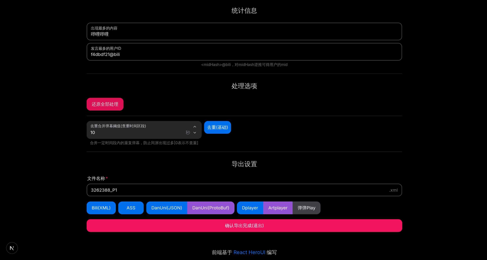

<h1 align="center" style="color:yellow">BiliBili历史全弹幕获取</h1>

## 一、项目简介

BiliBili历史全弹幕获取

- 支持BiliBili历史全弹幕获取, 内部爬取算法可以在 **最优最少** 请求次数下爬取弹幕, 并且 **不会** 丢失任何弹幕.`[1]`

- 支持多 Cookies 共同请求, 可从 Cookies池 中随机选择一个作为请求凭证. 可减少请求间隔.`[2]`

- 支持爬取视频、多P视频、番剧, 仅需输入对应的链接.

- 多任务管理, 可以保存各个任务的进度和爬取数据. 可选择性启动任务.

- 支持 Docker-Compose / DockerFile 一键私有部署

> 附注:
>
> `[1]`: 原理请见 [#14](https://github.com/HengXin666/BiLiBiLi_DanMu_Crawling/issues/14) *(该方法受BiliPlus全弹幕下载器启发)*
>
> `[2]`: 使用多个Cookies交替请求, 就像有多个账号轮流访问, 每个账号的访问频率保持正常, 但整体请求速度变快, 从而避免因单账号请求过快而被B站封禁.

## 二、功能展示

- 主页:

- 爬虫页面:

- 添加爬取任务页面: (支持番剧、多P视频)

- 爬虫页面 (多P则显示多个列表项):

- 配置凭证 (该配置是全局共享的):

- 导出弹幕 (支持进一步的弹幕处理):

- 弹幕处理界面 (可通过文件导入):

- 弹幕处理 (弹幕文件详情):

- 弹幕处理 (格式转换, 可导出多种弹幕格式):

## 三、使用说明

## 四、代码构建

- [Python 服务端](./py/README.md)

- [Web 前端](./web/README.md)

## 五、问题反馈

- 您可以提`Issues`, 我几乎都会看的qwq..

## 六、许可证

简单地说:

- 不允许商用行为

- 产生不良后果, 与作者无关

- 必要时, 请标明出处

## 七、致谢
### 7.1 感谢开源项目
- [哔哩哔哩 - API 收集整理](https://github.com/SocialSisterYi/bilibili-API-collect)

### 7.2 感谢各位项目支持者

感谢各位的支持, 如果喜欢的话可以点一个`Start`吗?

## 八、更新日志

- [2025-08-21 22:36:59] [V2.0.20] **V2.0 第一个正式版本**! 完成所有预期功能, 通过支持 Docker 部署.

- [2025-08-07 17:03:35] [V2.0.0-Beta_18] 更新py部分, 以支持`pyinstaller`打包和运行时路径正确.

- [2025-07-30 10:29:10] [V2.0.0-Beta_15] 
    - 支持 `补充 爬取历史弹幕` (用于长时间没有爬取, 又不希望重新爬取): (修复: ([#25](https://github.com/HengXin666/BiLiBiLi_DanMu_Crawling/issues/25) 的 `最后一点`: `当前的策略下若某天爬取完成，之后无法更新弹幕 (e.g. 创建时是07.15-07.25,爬完后改为07.28则无法对07.26-07.28时间段爬取)；可以采取新建一个表保存需爬取的时段，再在爬取时更新状态(未爬取|已爬取|跳过/无弹幕)`))
        - 扫描本地弹幕数据库中最晚(最新)的弹幕的日期. 作为 [L, R] 的 L
        - 以当前时间作为 R, 进行爬取. 用户只需要点击 `运行`, 如果该任务原本处于 `爬取历史弹幕完成`, 则会自动进行 `补充 爬取历史弹幕`.
    - 前端现在完成任务后会同步删除缓存的 taskId, 不需要点击暂停再运行.
    > 已知问题: 点击运行和暂停, 前端的数据展示并不会立即更新, 必须要等待建立ws连接后的发生配置更新信息时候, 才更新.

- [2025-07-29 10:36:31] [V2.0.0-Beta_14] 
    1. 修复: ([#25](https://github.com/HengXin666/BiLiBiLi_DanMu_Crawling/issues/25)) `同cid的不同任务会显示相同的任务日志(连接到了相同的ws端内容)`, 原因是前端的 LogHashMap 依然是以cid为key, 而不是cid.
    2. 实装Bas弹幕专包爬取在协程工作函数中
    3. 为前端暂停时候新增输出, 并且修改为被动退出 (即发送关闭给服务器后, 让服务器关闭ws, 以防止缺少信息...)
    4. 新增对 `前的策略下若某天爬取完成，之后无法更新弹幕` 描述的架构于临时架构说明...

- [2025-07-25 23:07:45] [V2.0.0-Beta_13] [#25](https://github.com/HengXin666/BiLiBiLi_DanMu_Crawling/issues/25): ` ws后端传输缺失：当开始一个任务后，第一次爬取的日期不会显示在web端而仅会出现在后端log`; 现在为后端新增一个 运行时消息队列, 如果前端消息小于该队列, 则补充消息; 并且提供文件日志, 不同推送ws, 仅供查看. 命名为 `{cid}_log.log`. 新增一个接口.

- [2025-07-20 14:20:25] [V2.0.0-Beta_12] 简单编写了 Web 关于界面

- [2025-07-20 13:49:01] [V2.0.0-Beta_11] 修复爬取时候因使用时间戳不是北京时间而导致丢失弹幕的问题 [#23](https://github.com/HengXin666/BiLiBiLi_DanMu_Crawling/issues/23)

- [2025-07-20 11:31:50] [V2.0.0-Beta_10] 修复弹幕导出的格式错误问题(有两个字段写错了)

- [2025-07-18 16:47:02] [V2.0.0-Beta_09] 新增弹幕处理web界面(新建文件夹); 发现问题

    1. 导出弹幕很慢, 因为需要先从数据库中查询, 然后再组装为 xml, 对于 100w 弹幕, 需要十几秒
    2. 弹幕可能不全面, 虽然爬取的很多, 但是不知道为什么高级弹幕比较少, 我的代码应该不会出问题啊qwq (今晚回去统计一下)

    3. @todo 还需要写爬取 Bas弹幕 的协程任务函数

- [2025-07-18 15:10:10] [V2.0.0-Beta_08] 修改部分接口, 因为需要支持相同cid情况, 因此为许多接口拓展出配置文件的唯一id: configId; 前端支持实时更新弹幕爬取状况, 支持删除配置

- [2025-07-16 10:22:32] [V2.0.0-Beta_07] 重构的新版本, 支持了xml导出(可选是否导出权重 (如果权重为0则不显示)); 支持爬取全弹幕; 目前还差支持 Bas弹幕 爬取; 以及前端的爬取事实状态的更新

---

- [2025-07-11 23:15:01] [V1.5.1] 修复 [#21](https://github.com/HengXin666/BiLiBiLi_DanMu_Crawling/issues/21) 爬取代码弹幕和bas直接显示内容为零的问题 (原因是爬取BAS弹幕专包时候没有使用新的解析方式)
- [2025-07-10 21:40:32] [V1.5.0] 修复了 [#18](https://github.com/HengXin666/BiLiBiLi_DanMu_Crawling/issues/18) 和 [#19](https://github.com/HengXin666/BiLiBiLi_DanMu_Crawling/issues/19) 中提到的 XML 转义字符的问题, 现在程序会对这些字符进行转义了!
- [2025-07-04 10:20:23] [V1.4.2] 合并了 [#17](https://github.com/HengXin666/BiLiBiLi_DanMu_Crawling/pull/17) 以支持获取弹幕权重(`权重字段可用于本地过滤弹幕(b站旧版的弹幕等级屏蔽功能)`), 但是似乎解析不到这个字段(?)
- [2025-06-21 23:13:02] [V1.4.1] 修复没有设置凭证, 就开始爬取会导致子线程退出的问题, 现在会及时给出提醒.
- [2025-06-21 23:04:54] [V1.4.0] 添加了一键构建 `AppImage` 的脚本 (自用) | 修改配置文件存放于系统配置文件目录 ([#16](https://github.com/HengXin666/BiLiBiLi_DanMu_Crawling/issues/16)) | 并且文件输出适配 win/linux 的环境
- [2025-06-21 17:31:55] [V1.3.2] 修复输出弹幕XML格式的问题 (注意, 如果需要获取到完整的XML, 需要手动终止爬取; 否则就需要手动为弹幕末尾添加`</i>`; 不然可能会在某些地方解析弹幕出错) ([#15](https://github.com/HengXin666/BiLiBiLi_DanMu_Crawling/issues/15)) | 调整了部分目录结构 | 新增了单独的版本描述文件
- [2025-04-29 21:00:25] [V1.3.1] 支持从番剧获取cid (支持从md、ss、ep号获取) ([#9](https://github.com/HengXin666/BiLiBiLi_DanMu_Crawling/issues/9))
- [2025-01-07 16:10:38] [V1.2.3] 修复无法保存是否使用`跳步爬取`的bug
- [2025-01-07 14:47:55] [V1.2.2] 修复`跳步爬取`, 如果跳出了有效范围, 会不爬取的问题, 即如果跳过了需要爬取的那一天, 则会默认爬取`endDate`那一天, 以防遗漏.
- [2025-01-06 17:30:33] [V1.2.1] 新增`跳步爬取`, 根据弹幕池的特性, 采取跳步爬取模式, 将连续几天的弹幕合并为一天爬取, 可是时间一般为原来的 $\frac{1}{5}$ (详细测试请查看[#8](https://github.com/HengXin666/BiLiBiLi_DanMu_Crawling/issues/8), 原理[#7](https://github.com/HengXin666/BiLiBiLi_DanMu_Crawling/issues/7))
- [2024-12-11 17:13:39] [V1.1.8] 修复指定开始、结束爬取时间无法及时生效的bug, 修复在去重文件时候出现Bas弹幕, 会导致程序崩溃的问题; 优化: 文件默认后缀是xml文件, 改名字不用手动输入后缀.xml
- [2024-11-15 14:56:05] [V1.1.7] 修复无法指定起始日期的bug
- [2024-11-02 13:21:03] [V1.1.6] 修复了一个潜在的f-string错误, 对项目进行`.exe打包`
- [2024-10-31 11:09:40] [V1.1.5] 修复了`始终爬取到当天`的日期显示不跟随的问题, 现在每次开启都会先检查一次日期
- [2024-10-28 21:38:17] [V1.1.4] 修复了`从指定日期开始`功能无法使用的问题, 现在每进行一次顺序爬取都会保存状态, 防止丢失进度.
- [2024-10-28 17:38:43] [V1.1.3] 修复了无限爬取Bas弹幕的Bug
- [2024-10-28 17:32:15] [V1.1.2] 修复了如果在继续爬取的时候, 重命名了文件并打算重新爬取, 导致删除文件, 文件找不到, 而终止线程的BUG
- [2024-10-27 15:06:19] [V1.1.1] 新增简单的弹幕文件操作, 支持去重和合并.
